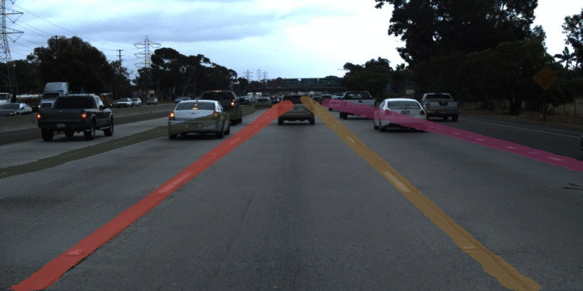

## Lanenet with Enet backbone ##
***

### Dataset ###
- [TuSimple Lane Detection](https://github.com/TuSimple/tusimple-benchmark/issues/3)

### Test Sample ###
***

### References ###
- [Towards End-to-End Lane Detection: an Instance Segmentation Approach](https://arxiv.org/pdf/1802.05591.pdf)
- [Learning Lightweight Lane Detection CNNs by Self Attention Distillation](https://arxiv.org/pdf/1908.00821.pdf)
- [Semantic Instance Segmentation with a Discriminative Loss Function](https://arxiv.org/pdf/1708.02551.pdf)
